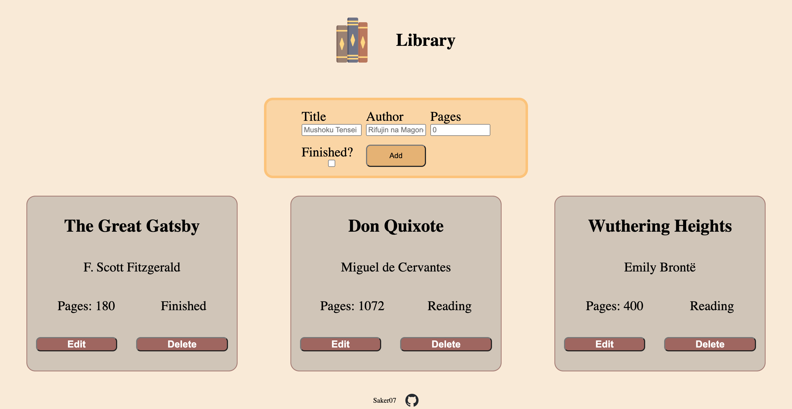
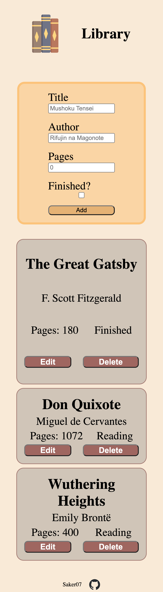

# library

A library website, you can add books with a title, an author, a number of pages, and set wether the book is read or not.
It stores the library array in local storage, it does not have any TTL.
It is written in plain javascript, so if you want to use it, just clone the repository and open index.html.
It does not have any media queries as they were not necessary, but it is still responsive to most displays.

Example for a laptop:

Example for a smartphone:

Credits:
Icon by SVG Repo (https://www.svgrepo.comSVG)
